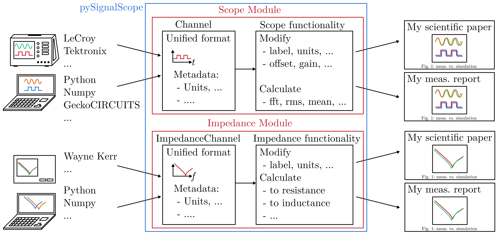

Scope toolbox for documentation purposes and comparisons
========================================================
Processing and comparison of time domain data similar to oscilloscopes in electronics. Typically used for technical comparisons in
 * Bachelor / Master / Ph.D. theses,
 * Scientific papers, 
 * Technical manuals, and
 * Measurement reports.

Overview
--------
Bring measurements from the oscilloscope and the circuit simulator into a standardized format. Edit the signals by shifting them in time (different zero points) or define the zero point for measuring equipment that can only record AC. Calculate the FFT or important values such as RMS, mean etc. Bring the originally different input formats into common plots to make comparisons easy.

Getting started
---------------
Install this repository into your virtual environment (venv) or jupyter notebook:

::

    pip install pysignalscope

Use the toolbox in your python program:

::
    import pysignalscope as pss
    ...

Examples
--------
Have a look at the `example <examples/scope_example.py>`__, to see what you can do with this toolbox.

Documentation
---------------------------------------

Find the documentation `here <https://upb-lea.github.io/pySignalScope/intro.html>`__.

Bug Reports
-----------
Please use the issues report button within GitHub to report bugs.

Changelog
---------
Find the changelog `here <CHANGELOG.md>`__.
