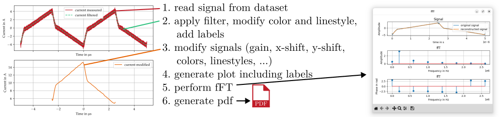

.. sectnum::

Scope toolbox for documentation purposes and comparisons
========================================================
Processing and comparison of time domain data similar to oscilloscopes in electronics. Typically used for technical comparisons in
 * Bachelor / Master / Ph.D. theses,
 * Scientific papers,
 * Technical manuals, and
 * Measurement reports.

Overview
--------
Bring measurements from the oscilloscope and the circuit simulator into a standardized format. Edit the signals by shifting them in time (different zero points) or define the zero point for measuring equipment that can only record AC. Calculate the FFT or important values such as RMS, mean etc. Bring the originally different input formats into common plots to make comparisons easy.

.. image:: figures/introduction.png

Getting started
---------------
Install this repository into your virtual environment (venv) or jupyter notebook:

::

    pip install pysignalscope

Use the toolbox in your python program:

::

    import pysignalscope as pss
    ...

Example usage
-------------
pySignalScope helps to load, edit, display and analyze the signals. The following application example loads a noisy measurement signal, which is first filtered. To simplify the display, colors, linestyle and the label can be attached to the object. This is shown in the plot above.

The lower plot shows the post-processing of the filtered signal. This is multiplied by a small gain, provided with an offset and shortened to a period duration. The label, color and line style are changed. The signals are then plotted with just one plot command.

Have a look at the `Scope example <https://github.com/upb-lea/pySignalScope/blob/main/examples/scope_example.py>`__ and at the `Impedance example <https://github.com/upb-lea/pySignalScope/blob/main/examples/impedance_example.py>`__ to see what you can do with this toolbox.

Naming convention
-------------------
This toolbox is divided into two modules: The functionality of an oscilloscope (``Scope``) and the functionality of an impedance analyzer (``Impedance``).

Scope
#####
The ``Scope`` module provides functionalities for editing and evaluating individual channels that are also provided by a real oscilloscope - just on a PC.
``Scope`` creates, imports, edits or evaluates ``Channels``. The following prefixes apply:

- ``generate_``: Generates a new ``Channel``
- ``no prefix``: Is applied to a ``Channel`` and results in a new ``Channel`` (e.g. ``add()`` adds two channels)
- ``from_``: Generates a ``Channel`` from an oscilloscope data set, a simulation program or a calculation (e.g. ``from_tektronix`` generates a ``Channel`` from a tektronix scope file)
- ``calc_``: Calculates individual values from a ``Channel`` (e.g. ``calc_rms()`` calculates the RMS from a given ``Channel``)
- ``plot_``: Plots channels in the desired arrangement (e.g. ``plot_channels()`` plots the given ``Channels``)

Impedance
#########
The ``Impedance`` module provides functionalities to evaluate impedance curves.
``Impedance`` creates, imports, edits or evaluates ``ImpedanceChannel``.

- ``generate_``: Generates a new ``ImpedanceChannel``
- ``no prefix``: Is applied to a ``ImpedanceChannel`` and results in a new ``ImpedanceChannel`` (e.g. ``modify()`` modifies an ``ImpedanceChannel``)
- ``from_``: Generates a ``ImpedanceChannel`` from an impedance analyzer data set, a simulation program or a calculation (e.g. ``from_waynekerr`` generates a ``ImpedanceChannel`` from a real measurement file)
- ``calc_``: Calculates individual values from a ``ImpedanceChannel`` (e.g. ``calc_rlc()`` calculates the equivalent resistance, inductance and capacitance)
- ``plot_``: Plots ``ImpedanceChannel`` (e.g. ``plot_impedance()`` plots the given ``ImpedanceChannels``)

Documentation
---------------------------------------

Find the documentation `here <https://upb-lea.github.io/pySignalScope/intro.html>`__.

Bug Reports
-----------
Please use the issues report button within GitHub to report bugs.

Changelog
---------
Find the changelog `here <CHANGELOG.md>`__.

pySignalScope function documentation
==================================================
.. currentmodule:: pysignalscope.scope

.. autoclass:: pysignalscope.Channel
   :members: 
   
.. autoclass:: pysignalscope.Scope
   :members: 
     
.. autoclass:: pysignalscope.ImpedanceChannel
   :members:
   
.. autoclass:: pysignalscope.Impedance
   :members:
  
.. automodule:: pysignalscope.functions
   :members:

.. automodule:: pysignalscope.generalplotsettings
   :members:

.. automodule:: pysignalscope.colors
   :members:
